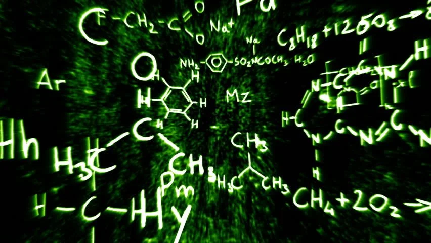

# BondsLab
BondsLab is an application that is used to visually create and interact with chemical compounds and molecules. 

It models how individual atoms behave to acheive stability, including their ability to create bonds, their valence electrons, and their charges, allowing users to create and experiemnt with the incredible variety of possible unique compounds out there.

The goal I had in mind while making this app was to help make chemistry feel more intuitive to students and learners, by allowing them to use this app to visualize how electrons interact and how atoms create and destroy chemical bonds.

This app gives learners the chance to gain a deeper and more conceptual understanding of chemistry and the behaviour of atoms

### Project Details:
This project has been written in C++ and mainly uses OpenGL, GLFW, and Dear ImGui for its rendering.

This project is currently under development and still has many bugs. Since this is a personal project of mine, I'm not really accepting contributions, but if you have any feedback or recommendations, please feel free to let me know. This is the first major project I've ever undertaken, and I've learnt a lot while making this project.

## Usage

Once you launch the app, you can use it to create and explore a variety of compounds:

- **Side Menu**
  - **Elements Tab**:  
    - Left-click on any element to create an atom with the default atomic mass and valency and 0 charge. 

    - Right-click to create a custom atom with modified charge or atomic mass.  
  - **Common Compounds Tab**:  
    - Used to quickly create premade common compounds such as H₂O (water), CO₂, and many others.


- **Top Menu**: 
  - **Settings**: Can be used to change the colors and behaviour of the app. 
  - **Edit**: Can be used to copy, cut, or paste compounds. (Compounds info can be stored as plaintext, which is copied and pasted here)
  - **Insert**: 
    You can insert more compounds to manipulate into the app by either:

    - **Direct**: Directly entering the text  representing the compound into the app
    - **From File**: Getting the text representing the compound from a text file

  - **Open**: Open a text file with other compounds' info to work on
  - **Save**: Save the compounds currently being worked on in the app to a text file
  - **Save As**: Save the compounds currently being worked on in the app to a text file
  - **Help**: Open this github page for assistance

- **Navigation**: Click and move mouse around to move around workspace. Scroll to zoom in or out

- **Selection**: 
  - Left-click an atom or bond to select it.
  - Right-click a compound, atom, or bond to open its context menu where you can do things like delete them, save them, etc
  - Shift + Click to select multiple atoms or compounds.
  - Click the background to deselect everything.

- **Bonding**:
  - **Covalent**: Drag the electron of an atom to an electron vacant spot of another atom to create a covalent bond. You must drag it to a spot that does not have any electron there but could have one. The exact position to move the electron to can be found out be seeing the outline that forms whenever the mouse hovers over such a spot.

  - **Dative**: Drag the electron vacant spot at the middle of each side of the atom to another electron vacant spot at the middle of each side of another atom to create a dative bond where the atom whose electron spot was dragged donates the lone pair.

  - **Ionic**: Drag the electron to the top right of another atom to create an ionic bond where the atom whose electron is dragged loses an electron.

### Some Inner Details:
 - In config folder, defaultConfig.json contains all the variables that can be changed to change the colors or positioning of things in the app. If you want to change the value of any variable, create a file called "config.json" in the config folder and give the values to the variables you want to change

  - Compounds can be represented as plain text (compound string) which is how this app saves the details of compounds to files and copies, cuts, or pastes them.

---
## Dependencies

This project uses both bundled libraries (included in the repository) and external dependencies (must be installed on your system).

### Bundled Libraries (included in `lib/`)
- [ImGui](https://github.com/ocornut/imgui) – Used for UI
- [stb_image](https://github.com/nothings/stb) – Used for Image Loading (header-only)  
- [nlohmann/json](https://github.com/nlohmann/json) – Used for JSON parsing (header-only)  

These do not need to be installed in your system

### External Dependencies (must be installed globally)
- [GLFW 3.4+](https://www.glfw.org/) – Window creation & input handling  
- [OpenGL 3.3+](https://www.opengl.org/) – Rendering backend  
- [GTK](https://www.gtk.org/) (optional, for file dialogs if enabled)  

## Installation

1. **Clone the repository:**
   ```bash
   git clone https://github.com/Antasma-X/BondsLab
2. **Navigate to the Repository**
    ```bash
    cd BondsLab
3. **Build the App**
    ```bash
    mkdir build
    cd build
    cmake ..
    make
4. **Run The App**
    ```bash
    ./BondsLab

---